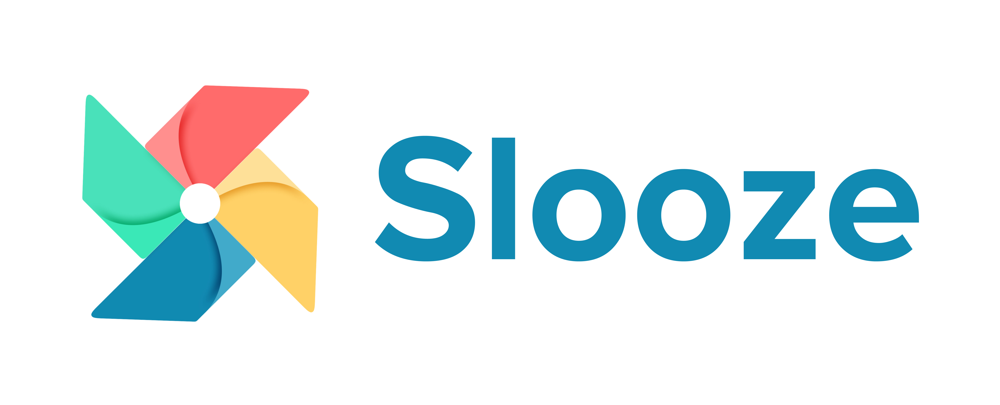

# Slooze take home challenge data-engineering

# 📌 Problem Statement

## Part A – Data Collection: Crawler/Scraper/Data Collection Implementation

Your task is to design and implement a **data gathering application** capable of extracting relevant information from [IndiaMART](https://www.indiamart.com), [AliBaba](https://www.alibaba.com/), or similar B2B marketplaces. You are expected to:

- Identify and target **a few meaningful product categories** (e.g., industrial machinery, electronics, textiles, etc.).
- Build a custom web crawler, use a third-party scraping tool, or integrate AI-powered data extraction — **you are free to choose the best approach** for your solution.
- Ensure that the application respects target site structures and avoids being blocked or rate-limited.

### ✅ Evaluation Criteria:
- **Effectiveness and robustness** of the crawler/data collector
- **Code quality**, modularity, and maintainability
- **Clean, structured, and relevant** data output (JSON/CSV/etc.)

---

## Part B – Exploratory Data Analysis (EDA)

After collecting the data, perform an **exploratory data analysis** to uncover meaningful insights. This may include:

- Summary statistics of the dataset (counts, distributions, trends)
- Identification of common attributes (e.g., top product types, price ranges, frequent keywords)
- Regional insights (e.g., location-based supplier patterns)
- Any anomalies, inconsistencies, or quality gaps in the scraped data
to name a few

### ✅ Evaluation Criteria:
- 📊 Visualizations and charts (where useful)
- 🧠 Insights or hypotheses based on your findings

---
## 📤 Submission
- Upload your code ( crawling, ETL, EDA and similar others) to GitHub or share as zip file
- Include instructions to run the code locally (e.g., python3, django)

> 💡 **Tip:** Creativity in your data gathering approach and depth in your analysis will be rewarded. Think of this as a mini end-to-end data engineering + analysis challenge.

## Connect with Us:

Reach out to **[careers@slooze.xyz](mailto:careers@slooze.xyz)** to submit your solutions or if you may have any questions related to the challenege

## © Copyright Notice

**© Slooze. All Rights Reserved.**

Please do not share or distribute this material outside the intended evaluation process.  
For queries, contact us !!

